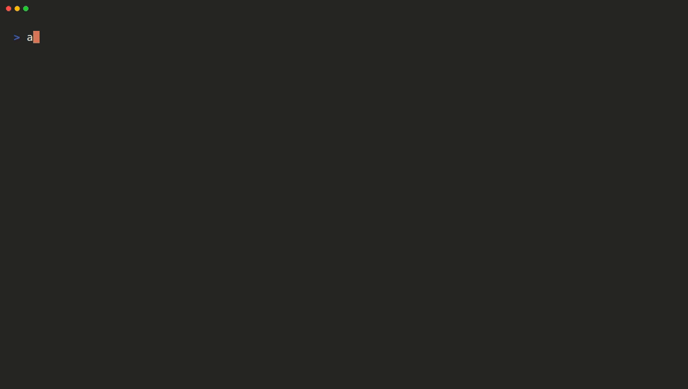

# ant — Claude Platform CLI

[](https://github.com/anthropics/anthropic-cli/releases)
[](https://github.com/anthropics/homebrew-tap)

`ant` is the official CLI for the [Claude Developer Platform](https://platform.claude.com/docs/en/api). It puts the Claude API in your terminal — send messages, manage agents and sessions, upload files, and script against every API endpoint.



## Documentation

Full documentation is available at **[platform.claude.com/docs/en/api/sdks/cli](https://platform.claude.com/docs/en/api/sdks/cli)**.

<!-- x-release-please-start-version -->

## Installation

### Homebrew

```sh
brew install anthropics/tap/ant
```

### Go

To install from source, you need [Go](https://go.dev/doc/install) version 1.22 or later.

```sh
go install 'github.com/anthropics/anthropic-cli/cmd/ant@latest'
```

The binary is placed in `$(go env GOPATH)/bin`. If `ant` isn't found after installation, add that directory to your `PATH`:

```sh
# Add to your shell profile (.zshrc, .bashrc, etc.)
export PATH="$PATH:$(go env GOPATH)/bin"
```

<!-- x-release-please-end -->

## Getting started

Log in with your Claude Console account:

```sh
ant auth login
```

Or set the `ANTHROPIC_API_KEY` environment variable to an API key from the [Claude Console](https://platform.claude.com/settings/keys).

Then send your first message:

```sh
ant messages create \
  --model claude-opus-4-8 \
  --max-tokens 1024 \
  --message '{role: user, content: "Hello, Claude"}'
```

Structured flags accept relaxed JSON or YAML, so unquoted keys are fine.

## Usage

The CLI follows a resource-based command structure, with nested resources separated by colons:

```sh
ant <resource>[:<subresource>] <command> [flags...]
```

```sh
# List available models
ant models list

# Browse a response in the interactive explorer (the default in a terminal)
ant models retrieve --model-id claude-opus-4-8

# Extract a single field from a response, jq-style
ant messages create \
  --model claude-opus-4-8 \
  --max-tokens 1024 \
  --message '{role: user, content: "Hello, Claude"}' \
  --transform content.0.text --raw-output

# Send a file using the @path syntax
ant messages create \
  --model claude-opus-4-8 \
  --max-tokens 1024 \
  --message '{role: user, content: [
    {type: image, source: {type: base64, media_type: image/jpeg, data: "@photo.jpg"}},
    {type: text, text: "What is in this image?"}
  ]}'

# Manage beta resources such as agents, sessions, and files
ant beta:agents list
```

Run `ant --help` for the full list of resources, or append `--help` to any command to see its flags.

## Requirements

macOS, Linux, or Windows.

## Development

### Running locally

After cloning the git repository for this project, you can use the `scripts/run` script to run the CLI locally:

```sh
./scripts/run args...
```

### Linking different Go SDK versions

You can link the CLI against a different version of the [Anthropic Go SDK](https://github.com/anthropics/anthropic-sdk-go) for development purposes using the `./scripts/link` script.

To link to a specific version from a repository (version can be a branch, git tag, or commit hash):

```sh
./scripts/link github.com/org/repo@version
```

To link to a local copy of the SDK:

```sh
./scripts/link ../path/to/anthropic-go
```

If you run the link script without any arguments, it will default to `../anthropic-go`.

### Re-recording the demo

The demo GIF at the top of this README is recorded with [VHS](https://github.com/charmbracelet/vhs) from [`.github/demo.tape`](.github/demo.tape). To re-record it after changing the examples, run:

```sh
./scripts/record-demo
```

## License

This project is licensed under the MIT License. See the [LICENSE](LICENSE) file for details.
