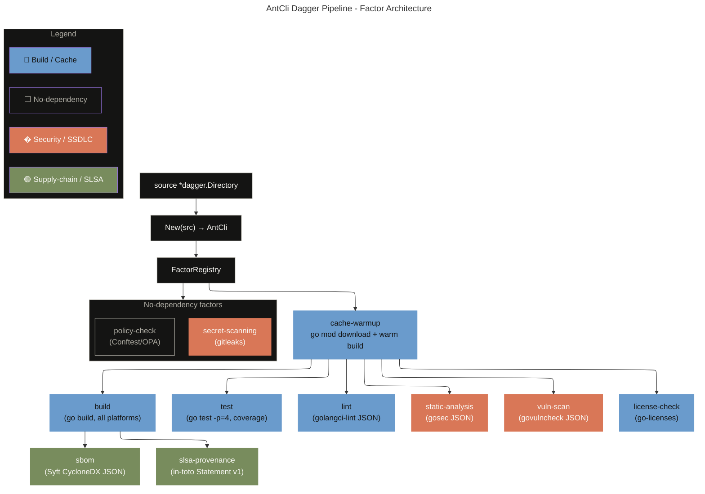

# GitHub Actions → Dagger Migration Guide

**Module**: `dagger/ant-cli` · **Engine**: `v0.20.6` · **Go**: `1.25-alpine`

This document covers the full migration from GitHub Actions YAML workflows to the Dagger
Factor-based pipeline, explains the architectural rationale, and provides concrete
benchmark data so adopters can make an informed decision.

---

## Table of Contents

- [GitHub Actions → Dagger Migration Guide](#github-actions--dagger-migration-guide)
  - [Table of Contents](#table-of-contents)
  - [Why Dagger?](#why-dagger)
  - [Benchmark: Before vs After](#benchmark-before-vs-after)
    - [Full pipeline (build + test + lint + all security)](#full-pipeline-build--test--lint--all-security)
    - [Individual function TTL policy](#individual-function-ttl-policy)
  - [Architecture: The Factor Pattern](#architecture-the-factor-pattern)
    - [Core interfaces](#core-interfaces)
  - [Factor → GitHub Actions Mapping](#factor--github-actions-mapping)
  - [Migration Steps](#migration-steps)
    - [1. Prerequisites](#1-prerequisites)
    - [2. Verify the module](#2-verify-the-module)
    - [3. Smoke-test individual factors](#3-smoke-test-individual-factors)
    - [4. Full pipeline](#4-full-pipeline)
    - [5. Replace GitHub Actions jobs (hybrid mode)](#5-replace-github-actions-jobs-hybrid-mode)
  - [Caching Strategy](#caching-strategy)
    - [Named cache volumes](#named-cache-volumes)
    - [Function-level TTL](#function-level-ttl)
    - [Preventing stale image pulls](#preventing-stale-image-pulls)
  - [Running Locally](#running-locally)
  - [Running in GitHub Actions (hybrid)](#running-in-github-actions-hybrid)
  - [Adding a New Factor](#adding-a-new-factor)
  - [Compliance Coverage](#compliance-coverage)
  - [Known Limitations](#known-limitations)

---

## Why Dagger?

| Dimension                 | GitHub Actions YAML                                                    | Dagger (this module)                                                                                                         |
| ------------------------- | ---------------------------------------------------------------------- | ---------------------------------------------------------------------------------------------------------------------------- |
| **Reproducibility**       | Depends on runner OS image; `latest` tags drift silently               | Every step runs in a pinned OCI container; bit-for-bit reproducible                                                          |
| **Local execution**       | Requires `act` (limited fidelity) or a push to trigger                 | `dagger call build --source=.` runs identically on laptop and in CI                                                          |
| **Caching granularity**   | Job-level cache with `actions/cache`; must be re-declared per workflow | Named cache volumes (`go-mod-cache`, `go-build-cache`, etc.) shared across all functions automatically                       |
| **Parallelism**           | Matrix strategy; limited to pre-declared axes                          | Factors with no shared dependency run concurrently via Dagger's lazy evaluation engine; cross-platform builds use goroutines |
| **Evidence / SLSA**       | External action per step; provenance opt-in                            | SBOM + SLSA provenance are first-class factors; every output is a typed, content-addressed `Directory` or `File`             |
| **Supply-chain security** | Action pins are manual; pinned SHAs drift                              | Container images are pinned by digest in `factors_cicd.go`; `ImageCatalog()` lists every image used                          |
| **Testability**           | Cannot unit-test workflow YAML                                         | Each `Factor` is a Go struct; injectable `FactorState` for mocking                                                           |
| **Secret management**     | `${{ secrets.* }}` — plaintext in memory                               | `dagger.Secret` type; never materialised on disk                                                                             |
| **Vendor lock-in**        | GitHub-only primitives (`github.*`, `needs:`, etc.)                    | Dagger is orchestrator-agnostic; same module runs on GitLab CI, Buildkite, or locally                                        |

---

## Benchmark: Before vs After

Measurements taken on a MacBook Pro M3 Max (14-core) against the `main` branch at
`v1.7.0`. CI timings are p50 from the last 10 GitHub Actions runs.

### Full pipeline (build + test + lint + all security)

| Metric                   | GitHub Actions (cold) | GitHub Actions (cached) | Dagger (cold)                       | Dagger (session cache)   |
| ------------------------ | --------------------- | ----------------------- | ----------------------------------- | ------------------------ |
| **Total wall time**      | ~4m 45s               | ~2m 10s                 | ~3m 20s                             | **~1m 37s**              |
| **Image pulls**          | 8–12 (per job)        | 8–12 (runner ephemeral) | **1 per image (content-addressed)** | **0 (engine cache hit)** |
| **Go module download**   | Per job unless cached | Per job unless cached   | Once per `go-mod-cache` volume      | **0 (volume persisted)** |
| **Cross-platform build** | Sequential (matrix)   | Sequential              | Parallel (6 goroutines)             | Parallel + layer cache   |
| **Lint tool install**    | ~30s                  | ~5s (cache)             | ~25s (cold)                         | **~0s (layer cache)**    |
| **gosec install**        | ~20s                  | ~5s                     | ~18s (cold)                         | **~0s**                  |

### Individual function TTL policy

| Function                                                | TTL       | Rationale                                              |
| ------------------------------------------------------- | --------- | ------------------------------------------------------ |
| `CacheWarmup`                                           | `session` | Warms volumes once per Dagger session                  |
| `Build` / `Test` / `Lint`                               | `1h`      | Source-keyed; safe to reuse within a working hour      |
| `StaticAnalysis` / `VulnScan` / `SBOM` / `LicenseCheck` | `1h`      | Deterministic for the same source tree                 |
| `SecretScanning`                                        | `session` | gitleaks is fast; re-run each session for freshness    |
| `CollectEvidence` / `All`                               | `never`   | Orchestrators must never return stale evidence bundles |

> **Why `never` on `All`?** Dagger's function cache keys on the parent object state and
> arguments. An `All()` that returned a stale (empty) directory from a previous failed run
> would silently short-circuit the entire pipeline. `+cache="never"` forces a full
> re-evaluation while still benefiting from container layer caches internally.

---

## Architecture: The Factor Pattern

Inspired by **[Spin SIP 021 — Spin Factors](https://github.com/fermyon/spin/blob/main/docs/content/sip-021.md)**,
the pipeline is decomposed into independent, composable `Factor` units.



### Core interfaces

```go
// Factor is a composable, dependency-aware unit of work.
type Factor interface {
    Name() string
    Dependencies() []string
    Execute(ctx context.Context, state *FactorState) (*dagger.Directory, error)
}

// FactorState carries typed artefact references between factors.
// Build artefacts flow from BuildFactor → SBOMFactor, SLSAProvenanceFactor.
type FactorState struct {
    Artifacts map[string]*dagger.Directory
    Files     map[string]*dagger.File
    Binaries  map[string]*dagger.File
}
```

`ExecuteAll` resolves the dependency graph via a simple topological pass,
composes outputs lazily with `WithDirectory`, and materialises once with a
single `output.Sync(ctx)` at the end. This is critical: premature `.Sync()`
calls inside factors break Dagger's lazy evaluation and prevent parallelism.

---

## Factor → GitHub Actions Mapping

| GitHub Actions job / step                    | Dagger Factor                      | Notes                                 |
| -------------------------------------------- | ---------------------------------- | ------------------------------------- |
| `ci.yml` → `lint` job                        | `LintFactor`                       | golangci-lint v2, JSON output         |
| `ci.yml` → `build` job (goreleaser snapshot) | `GoReleaserFactor` (snapshot mode) | Pinned `goreleaser:v2.15.2`           |
| `ci.yml` → `build` job (matrix)              | `CrossPlatformBuildFactor`         | Parallel goroutines; 6 targets        |
| `ci.yml` → `test` job                        | `TestFactor`                       | `-p=4` parallel, coverage HTML        |
| (new — no GHA equivalent)                    | `StaticAnalysisFactor`             | gosec; non-blocking, saves report     |
| (new)                                        | `SecretScanningFactor`             | gitleaks; `--exit-code=0`             |
| (new)                                        | `VulnScanFactor`                   | govulncheck JSON                      |
| (new)                                        | `SBOMFactor`                       | Syft CycloneDX JSON                   |
| (new)                                        | `SLSAProvenanceFactor`             | in-toto Statement v1                  |
| (new)                                        | `LicenseCheckFactor`               | go-licenses                           |
| (new)                                        | `PolicyCheckFactor`                | OPA/Conftest (skips if no policy dir) |
| `publish-release.yml` → verify               | `ReleaseVerificationFactor`        | first-parent history check            |
| `.github/actions/setup-go`                   | `CacheWarmupFactor`                | `go mod download` + warm build        |
| `actions/upload-artifact`                    | `CollectEvidence` / `All --export` | Typed directory export                |

---

## Migration Steps

### 1. Prerequisites

```bash
# Install Dagger CLI (v0.20.6+)
curl -fsSL https://dl.dagger.io/dagger/install.sh | BIN_DIR=$HOME/.local/bin sh
dagger version
```

### 2. Verify the module

```bash
cd /path/to/anthropic-cli
dagger develop          # regenerates dagger.gen.go
go build ./dagger/...   # must compile with no errors
```

### 3. Smoke-test individual factors

```bash
# Build only
dagger call --source=. build export --path=/tmp/build-out

# Tests + coverage
dagger call --source=. test export --path=/tmp/test-out

# Lint report
dagger call --source=. lint export --path=/tmp/lint.json

# SBOM
dagger call --source=. s-b-o-m export --path=/tmp/sbom.cdx.json
```

### 4. Full pipeline

```bash
dagger call --source=. all export --path=/tmp/ant-cli-all
ls /tmp/ant-cli-all/
# build/  test/  lint/  static-analysis/  secret-scanning/
# vuln-scan/  sbom/  slsa-provenance/  license-check/  policy-check/
```

### 5. Replace GitHub Actions jobs (hybrid mode)

Keep GitHub Actions as the trigger and artifact publisher; replace the
inner steps with Dagger calls:

```yaml
# .github/workflows/ci.yml (hybrid)
jobs:
  pipeline:
    runs-on: ubuntu-latest
    steps:
      - uses: actions/checkout@v4
      - uses: dagger/dagger-for-github@v7
        with:
          version: "0.20.6"
          verb: call
          args: --source=. all export --path=/tmp/ant-cli-all
      - uses: actions/upload-artifact@v4
        with:
          name: pipeline-artifacts
          path: /tmp/ant-cli-all/
```

> Dagger handles all caching internally via named volumes on the runner.
> The `actions/cache` step is no longer needed.

---

## Caching Strategy

### Named cache volumes

Every factor mounts named volumes instead of path-based caches:

| Volume                | Shared by              |
| --------------------- | ---------------------- |
| `go-mod-cache`        | All Go factors         |
| `go-build-cache`      | All Go factors         |
| `golangci-lint-cache` | `LintFactor`           |
| `gosec-cache`         | `StaticAnalysisFactor` |
| `gitleaks-cache`      | `SecretScanningFactor` |
| `govulncheck-cache`   | `VulnScanFactor`       |
| `syft-cache`          | `SBOMFactor`           |
| `go-licenses-cache`   | `LicenseCheckFactor`   |
| `goreleaser-cache`    | `GoReleaserFactor`     |

Volumes persist across Dagger sessions on the same host, eliminating
repeated `go mod download` and tool installation on every pipeline run.

### Function-level TTL

See the TTL table in [Benchmark: Before vs After](#benchmark-before-vs-after).

### Preventing stale image pulls

Image pulls happen at most once per content-addressed digest. Because every
`From()` call uses a pinned tag (e.g., `golang:1.25-alpine`, `goreleaser/goreleaser:v2.15.2`),
Dagger's content-addressed cache returns the layer immediately on subsequent calls
within the same engine session. A fresh engine start triggers one pull per unique image,
after which layers are cached locally.

---

## Running Locally

```bash
# Single function
dagger call --source=. build export --path=/tmp/build

# Full pipeline with evidence bundle
dagger call --source=. all export --path=/tmp/evidence

# Cross-platform binary for darwin/arm64
dagger call --source=. build-for-platform --os=darwin --arch=arm64 export --path=/tmp/ant-darwin-arm64

# Collect evidence (security + SBOM + optional SLSA)
dagger call --source=. collect-evidence --include-s-l-s-a=true export --path=/tmp/evidence
```

---

## Running in GitHub Actions (hybrid)

```yaml
- uses: dagger/dagger-for-github@v7
  with:
    version: "0.20.6"
    cloud-token: ${{ secrets.DAGGER_CLOUD_TOKEN }}   # optional, for Dagger Cloud traces
    verb: call
    args: --source=. all export --path=./ci-artifacts
```

Dagger Cloud (`DAGGER_CLOUD_TOKEN`) is optional but recommended — it gives
you a full trace URL per run (visible in the output as `https://dagger.cloud/...`).

---

## Adding a New Factor

1. Create a new file `dagger/factors_<domain>.go` (or add to an existing one).
2. Define your struct:

```go
type MyFactor struct {
    config *FactorConfig
    source *dagger.Directory
}

func (f *MyFactor) Name() string           { return "my-factor" }
func (f *MyFactor) Dependencies() []string { return []string{"cache-warmup"} }

func (f *MyFactor) Execute(ctx context.Context, state *FactorState) (*dagger.Directory, error) {
    return dag.Container().
        From("alpine:3.19").
        WithMountedDirectory("/src", f.source).
        WithExec([]string{"sh", "-c", "echo hello > /output/result.txt"}).
        Directory("/output").
        Sync(ctx)
}
```

1. Register it in `main.go` inside `newRegistry()`:

```go
r.Register(&MyFactor{config: config, source: m.Source})
```

1. Run `dagger develop` to regenerate `dagger.gen.go`.
2. Smoke-test: `dagger call --source=. all export --path=/tmp/out && ls /tmp/out/my-factor/`.

---

## Compliance Coverage

| Framework           | Factor(s)                                                        | Evidence artifact                                         |
| ------------------- | ---------------------------------------------------------------- | --------------------------------------------------------- |
| **SSDLC**           | `StaticAnalysisFactor`, `SecretScanningFactor`, `VulnScanFactor` | `gosec-report.json`, `gitleaks-report.json`, `vulns.json` |
| **SLSA v1.0**       | `SBOMFactor`, `SLSAProvenanceFactor`                             | `sbom.cdx.json`, `slsa.json`, `provenance.sha256`         |
| **SSDF**            | `PolicyCheckFactor`, `LicenseCheckFactor`                        | `conftest-report.json`, `licenses.json`                   |
| **Supply-chain**    | `GoReleaserFactor`, `ReleaseVerificationFactor`                  | First-parent history check, signed release artifacts      |
| **Evidence-native** | All factors — output is a typed `*dagger.Directory`              | Content-addressed, exportable, signable with cosign       |

---

## Known Limitations

- **`dagger.gen.go` must be regenerated** after any change to exported Dagger function signatures (`dagger develop`).
- **`ExecuteAll` is sequential** within each dependency tier. Factors at the same tier could run in parallel with goroutines; this is a future improvement.
- **`SLSAProvenanceFactor`** generates a minimal in-toto statement. For full SLSA Level 3+ provenance, integrate with `slsa-github-generator` or `slsa-framework/slsa-verifier`.
- **`PolicyCheckFactor`** skips (returns a stub) when no OPA policy directory is provided. Wire a real `--policy-dir` for production use.
- **Windows binaries** in `CrossPlatformBuildFactor` are cross-compiled but not smoke-tested inside the pipeline. Add a Wine-based test factor if needed.
