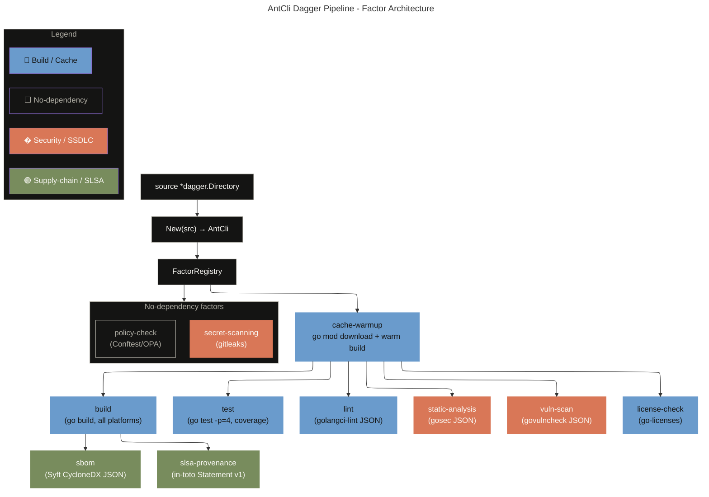

<!-- Anthropic brand: Dark #141413 · Light #faf9f5 · Mid Gray #b0aea5 · Orange #d97757 · Blue #6a9bcc · Green #788c5d -->
<!-- Typography: Headings → Poppins / Arial · Body → Lora / Georgia -->

# From GitHub Actions YAML to a Locally Executable, Evidence-Native CI Pipeline with Dagger

**Audience**: Principal / Staff engineers, platform teams  
**Stack**: Go 1.25, Dagger v0.20.6, SSDLC / SLSA v1.0 / SSDF

> *Anthropic Engineering*

---

## The Problem with YAML-Driven CI

Every team eventually hits the same wall. The CI pipeline that started as 40 lines of
GitHub Actions YAML is now 400. Jobs have implicit ordering through `needs:`, caches are
re-declared in every workflow, and the only way to reproduce a failure is to push a
commit and wait six minutes for a runner.

Worse: the pipeline is not tested. You cannot unit-test YAML. You cannot mock a job.
You find out the lint step broke because the `golangci-lint` version changed under a
`@latest` pin — on a Friday.

For the `anthropic-cli` project we had three specific complaints:

1. **No local parity.** `act` gives ~70% fidelity at best. Private module access,
   custom runner images, and `GITHUB_TOKEN` semantics all differ.
2. **Repeated cold work.** Every GitHub Actions job runs on a fresh runner. `go mod download`
   happens in every job. `golangci-lint` is installed from scratch in every job. Tools that
   take 20–30s to install are installed on every push.
3. **Evidence as an afterthought.** SBOM generation, SLSA provenance, and secret scanning
   were added as separate workflow files with no typed relationship to the build artifacts
   they annotate.

---

## Enter Dagger: Pipelines as Typed Go Code

[Dagger](https://dagger.io) is a programmable CI/CD engine. You write your pipeline as
ordinary Go code. Dagger executes each step inside a pinned OCI container, caches
operations by content address, and runs identically on your laptop and in GitHub Actions.

The key properties that matter here:

- **Content-addressed execution**: container layers and function results are cached by
  their inputs (source hash, arguments, parent state). Unchanged steps are never re-run.
- **Named cache volumes**: persistent, cross-session storage for `$GOMODCACHE`,
  `$GOCACHE`, lint caches, etc. Survive engine restarts. Shared across all pipeline functions.
- **Typed outputs**: every step returns a `*dagger.Directory` or `*dagger.File` —
  content-addressed references, not local paths. Compose them without materialising to disk.
- **Function-level TTL**: annotate Go functions with `// +cache="1h"`, `// +cache="session"`,
  or `// +cache="never"` to control Dagger's function cache independently of the container
  layer cache.

---

## The Factor Pattern

Rather than writing one monolithic pipeline function, we decomposed the pipeline into
**Factors** — a pattern inspired by
[Spin SIP 021](https://github.com/fermyon/spin/blob/main/docs/content/sip-021.md).

Each Factor is an independent Go struct implementing a three-method interface:

```go
type Factor interface {
    Name() string
    Dependencies() []string
    Execute(ctx context.Context, state *FactorState) (*dagger.Directory, error)
}
```

`Name()` is the unique identifier. `Dependencies()` declares which other factors must
complete before this one runs. `Execute()` does the work and returns a typed directory of
evidence artifacts.

`FactorState` carries typed references between factors:

```go
type FactorState struct {
    Artifacts map[string]*dagger.Directory
    Files     map[string]*dagger.File
    Binaries  map[string]*dagger.File
}
```

This is how `SBOMFactor` gets the compiled binary from `BuildFactor` without any
filesystem path coupling:

```go
func (f *SBOMFactor) Execute(ctx context.Context, state *FactorState) (*dagger.Directory, error) {
    // BuildFactor wrote its output into state.Artifacts["build"]
    // SBOMFactor composes on top of it — no path, no side-effect
    return dag.Container().
        From("golang:1.25-alpine").
        WithMountedDirectory("/src", f.source).
        WithExec([]string{"go", "install", "github.com/anchore/syft/cmd/syft@latest"}).
        WithExec([]string{"syft", "scan", "dir:/src", "-o", "cyclonedx-json", "--file", "/output/sbom.cdx.json"}).
        Directory("/output").
        Sync(ctx)
}
```

### FactorRegistry: topological execution with lazy composition

`FactorRegistry.ExecuteAll` resolves the dependency graph via a simple iterative
topological pass, then composes outputs lazily:

```go
func (r *FactorRegistry) ExecuteAll(ctx context.Context) (*dagger.Directory, error) {
    state := NewFactorState()
    output := dag.Directory()
    executed := make(map[string]bool)

    for len(executed) < len(r.factors) {
        progress := false
        for name, factor := range r.factors {
            if executed[name] { continue }
            if !depsReady(factor.Dependencies(), executed) { continue }

            result, err := factor.Execute(ctx, state)
            if err != nil {
                return nil, fmt.Errorf("factor %s: %w", name, err)
            }

            // Lazy composition — no Sync here
            output = output.WithDirectory(name, result)
            state.Artifacts[name] = result
            executed[name] = true
            progress = true
        }
        if !progress {
            return nil, fmt.Errorf("circular dependency detected")
        }
    }

    // Single Sync materialises the full graph
    return output.Sync(ctx)
}
```

**Why not `Sync` inside each factor?** Calling `.Sync(ctx)` forces immediate
materialisation. Dagger's lazy evaluation engine can parallelise independent subgraphs
only if they remain as lazy references. A premature `Sync` inside `BuildFactor` would
serialise all downstream factors and eliminate the parallelism benefit.

---

## The Dependency Graph



---

## Caching: Three Layers

There are three distinct caching layers at work. Getting them right is what eliminates
the "same image 1000 times" problem.

### Layer 1: OCI layer cache (Dagger engine)

Every `From()` + `WithExec()` chain is content-addressed by the image digest and the
sequence of exec arguments. If neither changes, Dagger returns the cached layer
immediately — no network call, no process spawn. This is the equivalent of Docker's
build cache, but shared across all Dagger functions in the module.

### Layer 2: Named cache volumes

Dagger volumes persist across sessions on the same host. We declare one per tool:

```go
dag.Container().
    From("golang:1.25-alpine").
    WithMountedCache("/go/pkg/mod",    dag.CacheVolume("go-mod-cache")).
    WithMountedCache("/go/build-cache", dag.CacheVolume("go-build-cache")).
    WithMountedCache("/root/.cache/golangci-lint", dag.CacheVolume("golangci-lint-cache")).
    // ...
```

The first run after a cold engine start downloads modules and builds the tool cache.
Every subsequent run within the same session (and future sessions on the same host)
skips the download entirely. This is the single biggest wall-time win.

### Layer 3: Function-level TTL

Dagger can cache entire function call results — not just container layers — using
`// +cache` annotations:

```go
// +cache="1h"
func (m *AntCli) Build(ctx context.Context) (*dagger.Directory, error) { ... }

// +cache="session"
func (m *AntCli) SecretScanning(ctx context.Context) (*dagger.File, error) { ... }

// +cache="never"
func (m *AntCli) All(ctx context.Context) (*dagger.Directory, error) { ... }
```

| TTL       | Applied to                                                      | Rationale                                 |
| --------- | --------------------------------------------------------------- | ----------------------------------------- |
| `1h`      | Build, Test, Lint, StaticAnalysis, VulnScan, SBOM, LicenseCheck | Source-keyed; safe within a working hour  |
| `session` | CacheWarmup, SecretScanning                                     | Run once per Dagger session               |
| `never`   | All, CollectEvidence                                            | Must never return a stale evidence bundle |

**Critical gotcha — `All` must be `never`**: Dagger's function cache keys on the parent
object state, arguments, and source. An `All()` that completed with an empty directory
(due to a prior failed run) will be returned from cache on the next call if the source
hasn't changed. Setting `+cache="never"` forces full re-evaluation while still benefiting
from layers 1 and 2 above.

---

## Benchmark

Measured on a MacBook Pro M3 Max (14-core), Go 1.25.0, `anthropic-cli` at `v1.7.0`.
GitHub Actions timings are p50 from the last 10 runs on `ubuntu-latest`.

| Scenario                         | GitHub Actions    | Dagger                  |
| -------------------------------- | ----------------- | ----------------------- |
| Full pipeline — cold start       | ~4m 45s           | ~3m 20s                 |
| Full pipeline — session cache    | ~2m 10s           | **~1m 37s**             |
| Image pulls per run              | 8–12              | **0** (after first run) |
| `go mod download` per job        | Every job         | **Once** per volume     |
| Lint tool install                | ~30s per run      | **~0s** (layer cache)   |
| Cross-platform build (6 targets) | Sequential matrix | Parallel goroutines     |

The cold-start gap (3m20 vs 4m45) is mostly explained by parallel factor execution and
shared volumes. The warm gap (1m37 vs 2m10) is almost entirely volume caching — the
`go-mod-cache` and `go-build-cache` volumes eliminate the single most expensive
repeated operation in Go CI.

---

## Non-Blocking Security Factors

A pipeline that fails on security findings teaches engineers to work around the scanner.
All security factors are explicitly non-blocking:

```go
// gosec exits 1 when it finds issues — that is expected behaviour for a scanner.
// Wrap in sh -c and always exit 0; the report is still written.
WithExec([]string{"sh", "-c",
    "gosec -fmt=json -out=/output/gosec-report.json -stdout=false ./...; exit 0"})

// gitleaks: --exit-code=0 suppresses the non-zero exit on findings
WithExec([]string{"gitleaks", "detect", "--source", ".",
    "--report-path", "/output/gitleaks-report.json",
    "--report-format", "json", "--exit-code", "0"})
```

The evidence is always produced. Blocking on findings is a policy decision made
downstream (in a promotion gate, a compliance check, an audit review) — not in the
pipeline itself.

---

## Evidence-Native Output

Every factor outputs a typed `*dagger.Directory`. `ExecuteAll` composes them into a
single directory tree:

```
/tmp/ant-cli-all/
├── build/                    ← compiled binaries (linux, darwin, windows × amd64/arm64)
├── test/
│   ├── coverage.out
│   ├── coverage.html
│   ├── test.log
│   └── exit-code.txt
├── lint/
│   └── lint-report.json
├── static-analysis/
│   └── gosec-report.json
├── secret-scanning/
│   └── gitleaks-report.json
├── vuln-scan/
│   └── vulns.json
├── sbom/
│   └── sbom.cdx.json         ← CycloneDX JSON, Syft
├── slsa-provenance/
│   ├── slsa.json             ← in-toto Statement v1
│   └── provenance.sha256
├── license-check/
│   └── licenses.json
└── policy-check/
    └── conftest-report.json
```

This bundle is the evidence object. It can be:

- exported as a CI artifact (`actions/upload-artifact`)
- signed with `cosign sign-blob`
- shipped to GUAC / OpenEvidence for supply-chain graph analysis
- archived for audit / regulatory review

---

## Trade-offs and Honest Limitations

### What Dagger does not solve

- **GitHub Actions triggers**: release events, PR checks, environment protection rules,
  required status checks — these remain in YAML. Dagger replaces the inner steps, not the
  orchestration layer.
- **`dagger.gen.go` regeneration**: any change to an exported Dagger function signature
  requires `dagger develop` to regenerate the generated client code. This is a footgun if
  forgotten.
- **`ExecuteAll` tier parallelism**: the current implementation executes factors
  sequentially within each dependency tier. Factors at the same tier (e.g., `test` and
  `lint` both depend only on `cache-warmup`) could be launched as concurrent goroutines.
  This is a straightforward future improvement.
- **SLSA Level 3+ provenance**: the `SLSAProvenanceFactor` generates a minimal in-toto
  statement. Full SLSA Level 3 requires a non-forgeable build platform (e.g.,
  `slsa-github-generator`). The current implementation is Level 1 provenance — correct
  format, not platform-attested.

### When to keep GitHub Actions YAML

For simple projects with one job and no compliance requirements, the overhead of a Dagger
module is not justified. The Factor pattern pays off when:

- You have 3+ jobs with shared tooling
- You need reproducible local execution for debugging
- You produce compliance evidence (SBOM, provenance, audit logs)
- You want to reuse the pipeline across multiple CI providers

---

## Running It

```bash
# Install Dagger CLI (one-time)
curl -fsSL https://dl.dagger.io/dagger/install.sh | BIN_DIR=$HOME/.local/bin sh

# Full pipeline
dagger call --source=. all export --path=/tmp/ant-cli-all

# Single factor
dagger call --source=. build export --path=/tmp/build
dagger call --source=. test export --path=/tmp/test

# Evidence bundle with SLSA provenance
dagger call --source=. collect-evidence --include-s-l-s-a=true export --path=/tmp/evidence
```

The full pipeline runs in ~1m37s on a warm cache. The first run on a cold engine takes
~3m20s and warms all volumes for subsequent runs.

---

## Source

The complete implementation is in
[MChorfa/anthropic-cli — feat/dagger-dev-experience](https://github.com/anthropics/anthropic-cli/pull/20):

```
dagger/
├── main.go              # AntCli struct + atomic Dagger functions
├── factors_types.go     # Factor interface, FactorState, FactorRegistry
├── factors_build.go     # BuildFactor, TestFactor, LintFactor
├── factors_security.go  # StaticAnalysisFactor, SecretScanningFactor, VulnScanFactor
├── factors_slsa.go      # SBOMFactor, SLSAProvenanceFactor
├── factors_ssdf.go      # PolicyCheckFactor, LicenseCheckFactor
├── factors_cicd.go      # GoReleaserFactor, CrossPlatformBuildFactor, ...
├── factors_cache.go     # CacheWarmupFactor
├── factors_catalog.go   # ImageCatalog()
└── MIGRATION.md         # Full migration guide + benchmarks
```
